# Задачи с собеседований!

Я разбил задачи на группы по подходам, которые в них используются:  

1. [Задачи про 3 суммы](https://github.com/curlyapollo/leetcode/tree/main/3sum)
2. [Задачи на бинарный поиск](https://github.com/curlyapollo/leetcode/tree/main/bin_search)
3. [Задачи на графы](https://github.com/curlyapollo/leetcode/tree/main/binary_tree)
4. [Задачи на проектирование собственных классов](https://github.com/curlyapollo/leetcode/tree/main/design)
5. [Задачи про связные списки](https://github.com/curlyapollo/leetcode/tree/main/linked_lists)
6. [Задачи на префиксные суммы и предподсчет](https://github.com/curlyapollo/leetcode/tree/main/prefix_sum)
7. [Задачи, использующие стек](https://github.com/curlyapollo/leetcode/tree/main/stack)
8. [Задачи на работу со строками](https://github.com/curlyapollo/leetcode/tree/main/string)
9. [Задачи на два указателя](https://github.com/curlyapollo/leetcode/tree/main/two_pointers)
10. [Остальные задачи)](https://github.com/curlyapollo/leetcode/tree/main/other)

Теперь раскажу про каждую задачу отдельно:

<h1 align="center"><a href="https://github.com/curlyapollo/leetcode/tree/main/3sum">
  3sum
</a></h1>

## 1. 3sum [(leetcode)](https://leetcode.com/problems/3sum)  ✅
  ### Условие:  
  
  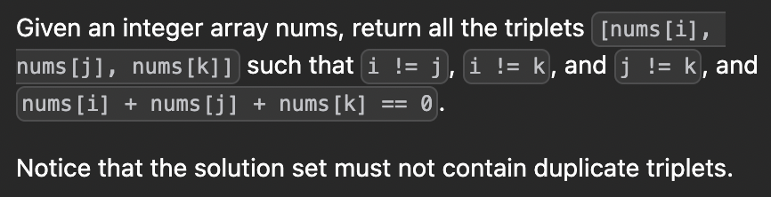  

  ### [Решение](3sum/3sum/main.py)

## 2. 3sum Closest [(leetcode)](https://leetcode.com/problems/3sum-closest)  ❌
  ### Условие:  
  
  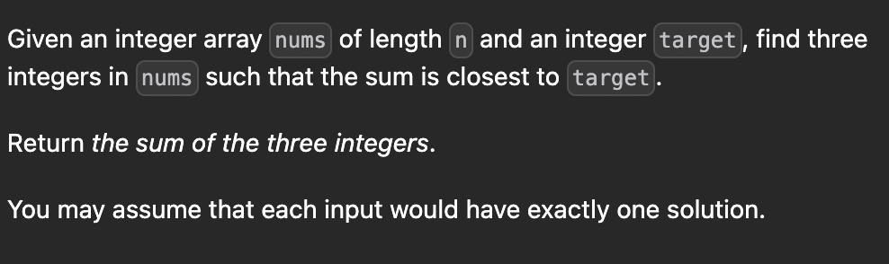  

  ### [Решение](3sum/3sum_closest/main.py)

<h1 align="center"><a href="https://github.com/curlyapollo/leetcode/tree/main/bin_search">
  Binary Search
</a></h1>

## 3. Binary search [(leetcode)](https://leetcode.com/problems/binary-search) ✅
  ### Условие:  
  
  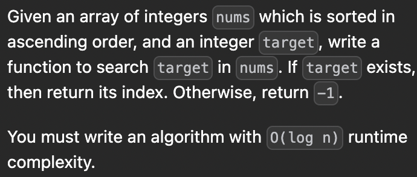  

  ### [Решение](bin_search/binary_search/main.py)

## 4. Find First and Last Position of Element in Sorted Array [(leetcode)](https://leetcode.com/problems/find-first-and-last-position-of-element-in-sorted-array) 🌀
  ### Условие:  
  
  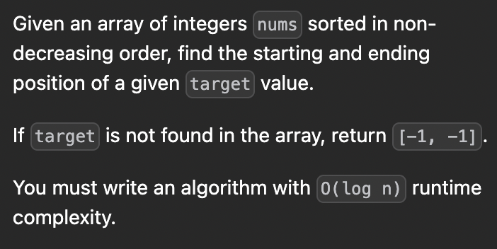  

  ### [Решение](bin_search/find_first_and_last_position_of_element_in_sorted_array/main.py)

## 5. Find K Closest Elements [(leetcode)](https://leetcode.com/problems/find-k-closest-elements)❌‼️
  ### Условие:  
  
  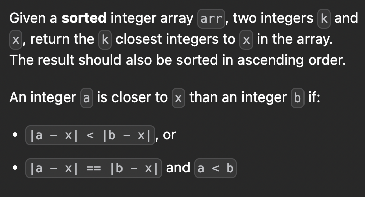  

  ### [Решение](bin_search/find_k_closest_elements/main.py)

## 6. Find Minimum in Rotated Sorted Array [(leetcode)](https://leetcode.com/problems/find-minimum-in-rotated-sorted-array)✅
  ### Условие:  
  
  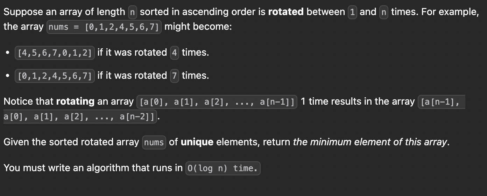  

  ### [Решение](bin_search/find_minimum_in_rotated_sorted_array/main.py)

## 7. Median of Two Sorted Arrays [(leetcode)](https://leetcode.com/problems/median-of-two-sorted-arrays)
  ### Условие:  
  
  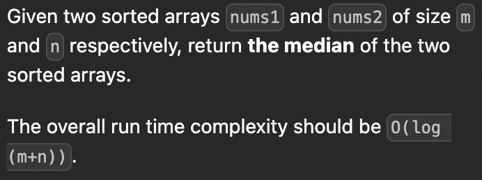  

  ### [Решение](bin_search/median_of_two_sorted_arrays/main.py)

## 8. Search a 2D Matrix [(leetcode)](https://leetcode.com/problems/search-a-2d-matrix)
  ### Условие:  
  
  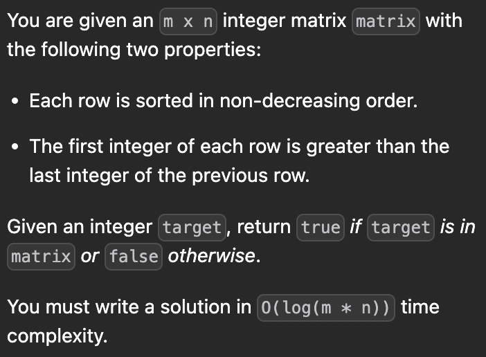  

  ### [Решение](bin_search/search_in_2d_matrix/main.py)

## 9. Search in Rotated Sorted Array [(leetcode)](https://leetcode.com/problems/search-in-rotated-sorted-array)
  ### Условие:  
  
  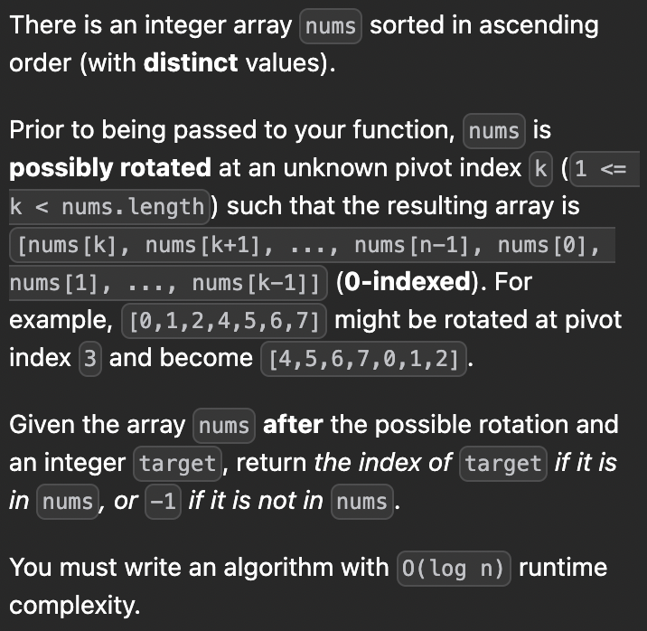  

  ### [Решение](bin_search/search_in_rotated_sorted_array/main.py)

<h1 align="center"><a href="https://github.com/curlyapollo/leetcode/tree/main/binary_tree">
  Graphs
</a></h1>

## 10. Balanced Binary Tree [(leetcode)](https://leetcode.com/problems/balanced-binary-tree)
  ### Условие:  
  
    

  ### [Решение](bin_search/balanced_binary_tree/main.py)
  
## 11. Binary Tree Level Order Traversal [(leetcode)](https://leetcode.com/problems/binary-tree-level-order-traversal)
  ### Условие:  
  
  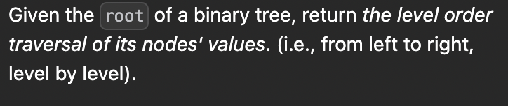  

  ### [Решение](bin_search/binary_tree_level_order_traversal/main.py)

## 12. Binary Tree Zigzag Level Order Traversal [(leetcode)](https://leetcode.com/problems/binary-tree-zigzag-level-order-traversal)
  ### Условие:  
  
  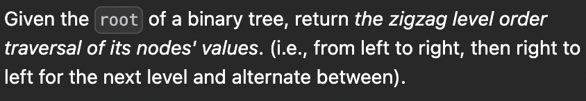  

  ### [Решение](bin_search/binary_tree_level_order_traversal/main.py)

## 13. Binary Tree Maximum Path Sum [(leetcode)](https://leetcode.com/problems/binary-tree-maximum-path-sum)
  ### Условие:  
  
  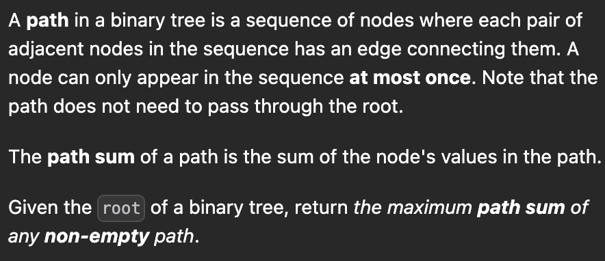  

  ### [Решение](bin_search/binary_tree_maximum_path_sum/main.py)

## 14. Find Duplicate Subtrees [(leetcode)](https://leetcode.com/problems/find-duplicate-subtrees)
  ### Условие:  
  
  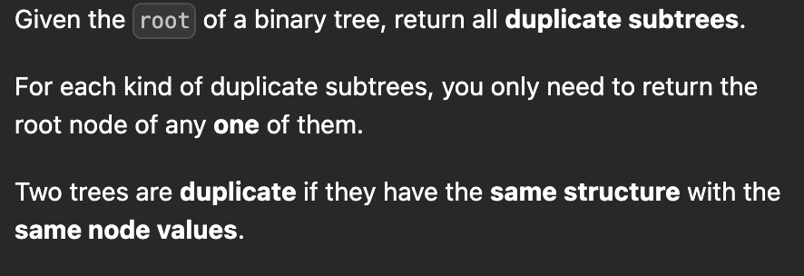  

  ### [Решение](bin_search/find_duplicate_subtrees/main.py)

## 15. Lowest Common Ancestor of a Binary Search Tree [(leetcode)](https://leetcode.com/problems/lowest-common-ancestor-of-a-binary-search-tree)
  ### Условие:  
  
  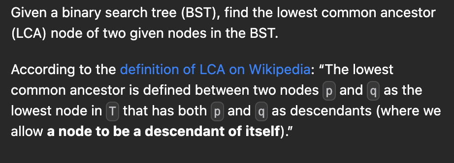  

  ### [Решение](bin_search/lowest_common_ancestor_of_a_binary_search_tree/main.py)

## 16. Lowest Common Ancestor of a Binary Tree [(leetcode)](https://leetcode.com/problems/lowest-common-ancestor-of-a-binary-tree)
  ### Условие:  
  
  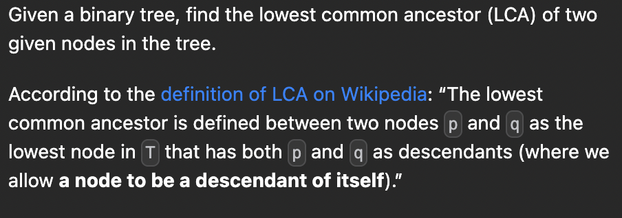  

  ### [Решение](bin_search/lowest_common_ancestor_of_a_binary_tree/main.py)

## 17. Lowest Common Ancestor of a Binary Tree III [(leetcode)](https://leetcode.com/problems/lowest-common-ancestor-of-a-binary-tree-iii)
  ### Условие:  
  
  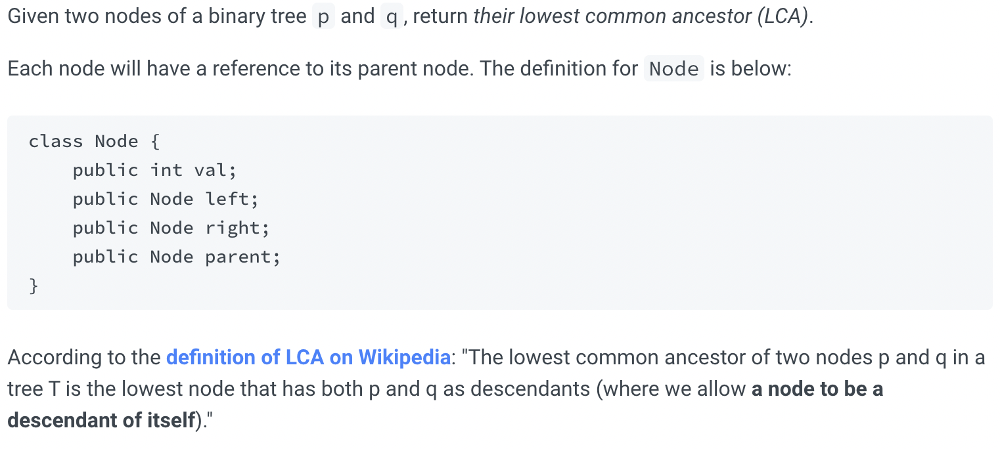  

  ### [Решение](bin_search/lowest_common_ancestor_of_a_binary_tree_III/main.py)

## 18. Maximum Depth of Binary Tree [(leetcode)](https://leetcode.com/problems/maximum-depth-of-binary-tree)
  ### Условие:  
  
  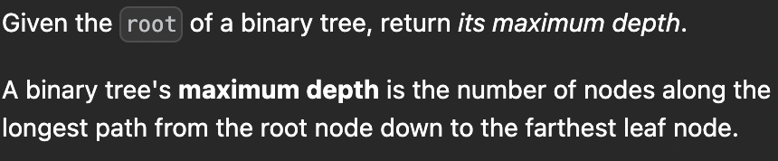  

  ### [Решение](bin_search/maximum_depth_of_binary_tree/main.py)

## 19. Number of Islands [(leetcode)](https://leetcode.com/problems/number-of-islands)
  ### Условие:  
  
  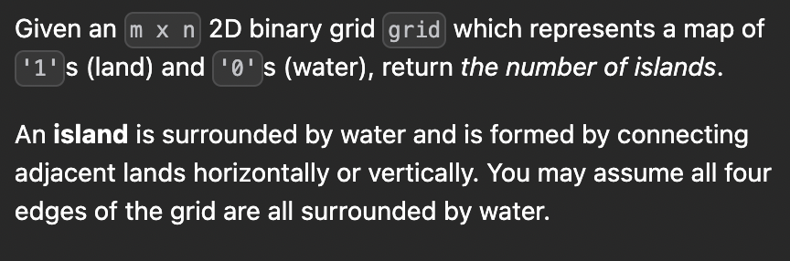  

  ### [Решение](bin_search/number_of_islands/main.py)

## 20. Range Sum of BST [(leetcode)](https://leetcode.com/problems/range-sum-of-bst)
  ### Условие:  
  
    

  ### [Решение](bin_search/range_sum_of_bst/main.py)

## 21. Reconstruct Itinerary [(leetcode)](https://leetcode.com/problems/reconstruct-itinerary)
  ### Условие:  
  
  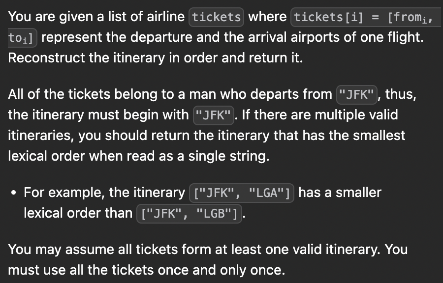  

  ### [Решение](bin_search/reconstruct_itinerary/main.py)

## 22. Same Tree [(leetcode)](https://leetcode.com/problems/same-tree)
  ### Условие:  
  
  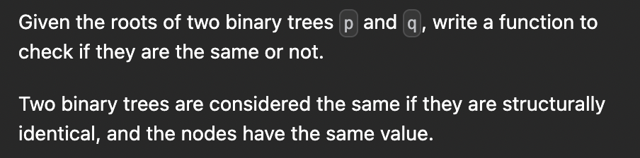  

  ### [Решение](bin_search/same_tree/main.py)

## 23. Serialize and Deserialize BST [(leetcode)](https://leetcode.com/problems/serialize-and-deserialize-bst)
  ### Условие:  
  
  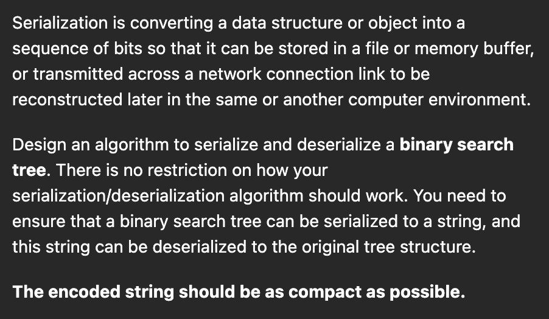  

  ### [Решение](bin_search/serialize_and_deserialize_bst/main.py)

## 24. Sum of Left Leaves [(leetcode)](https://leetcode.com/problems/sum-of-left-leaves)
  ### Условие:  
  
  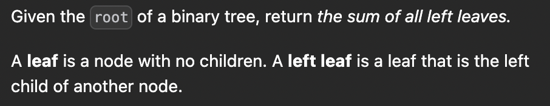  

  ### [Решение](bin_search/sum_of_left_leaves/main.py)

## 25. Symmetric Tree [(leetcode)](https://leetcode.com/problems/symmetric-tree)
  ### Условие:  
  
  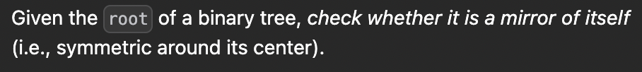  

  ### [Решение](bin_search/symmetric_tree/main.py)

## 26. Validate Binary Search Tree [(leetcode)](https://leetcode.com/problems/validate-binary-search-tree)
  ### Условие:  
  
  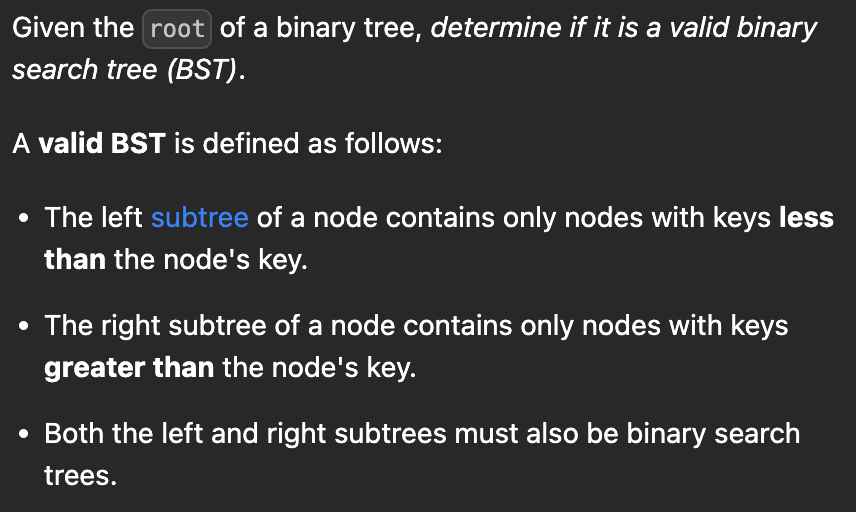  

  ### [Решение](bin_search/validate_binary_search_tree/main.py)

<h1 align="center"><a href="https://github.com/curlyapollo/leetcode/tree/main/design">
  Design
</a></h1>

## 27. Design an ATM Machine [(leetcode)](https://leetcode.com/problems/design-an-atm-machine)
  ### Условие:  
  
  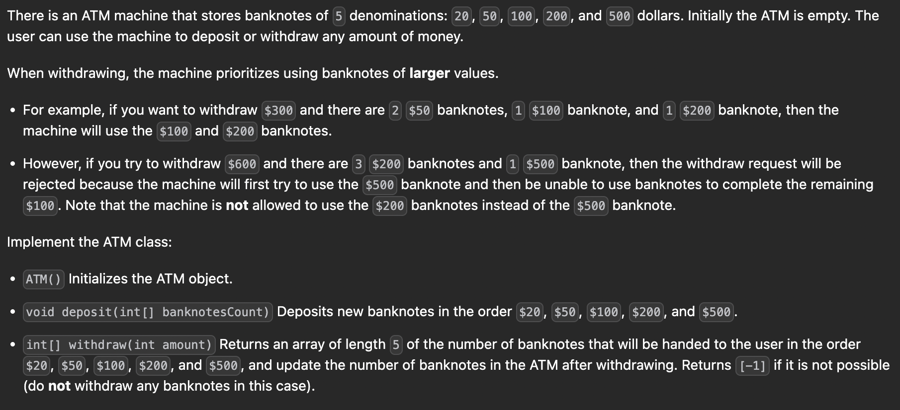  

  ### [Решение](design/design_an_ATM_machine/main.py)

## 28. Design Hit Counter [(leetcode)](https://leetcode.com/problems/design-hit-counter)
  ### Условие:  
  
  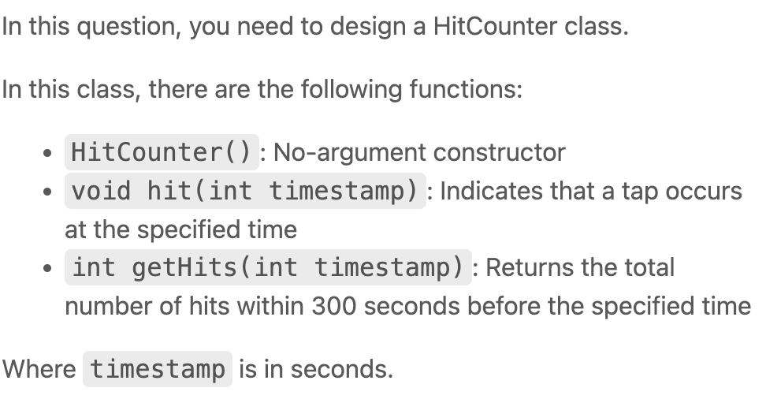  

  ### [Решение](design/design_hit_counter/main.py)

## 29. Flatten Nested List Iterator [(leetcode)](https://leetcode.com/problems/flatten-nested-list-iterator)
  ### Условие:  
  
  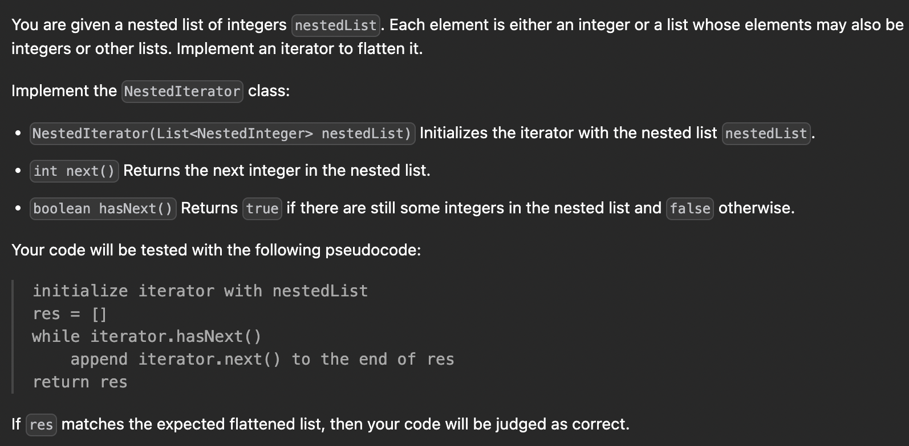  

  ### [Решение](design/flatten_nested_list_iterator/main.py)

## 30. Implement Rand10() Using Rand7() [(leetcode)](https://leetcode.com/problems/implement-rand10-using-rand7)
  ### Условие:  
  
  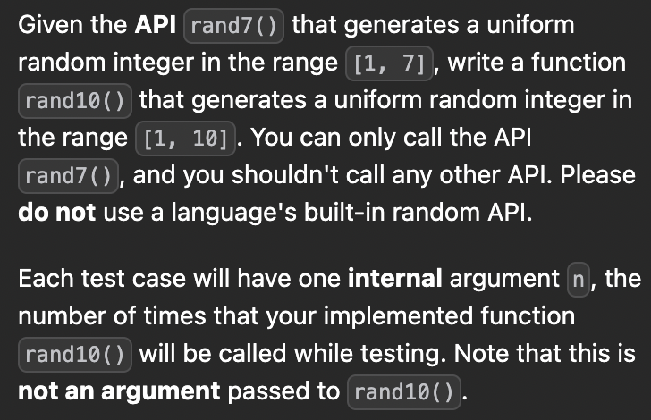  

  ### [Решение](design/implement_rand10()_using_rand7()/main.py)

## 31. Insert Delete GetRandom O(1) [(leetcode)](https://leetcode.com/problems/insert-delete-getrandom-o1)
  ### Условие:  
  
  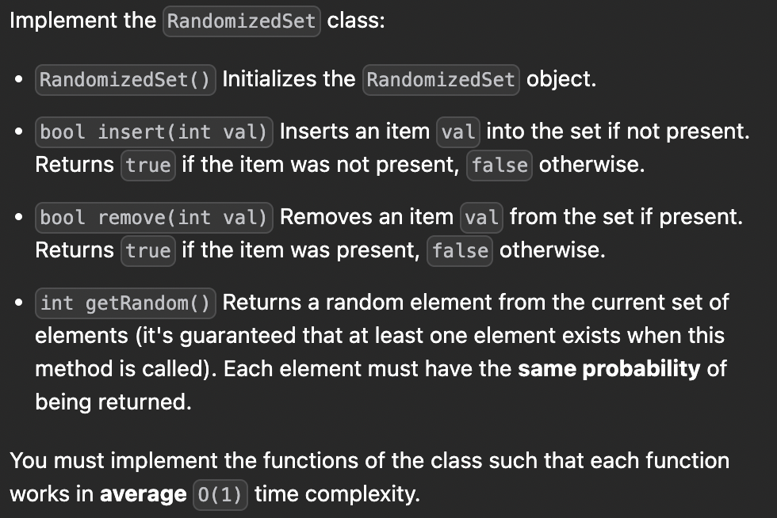  

  ### [Решение](design/insert_delete_getRandom_O(1)/main.py)

## 32. LRU Cache [(leetcode)](https://leetcode.com/problems/lru-cache)
  ### Условие:  
  
  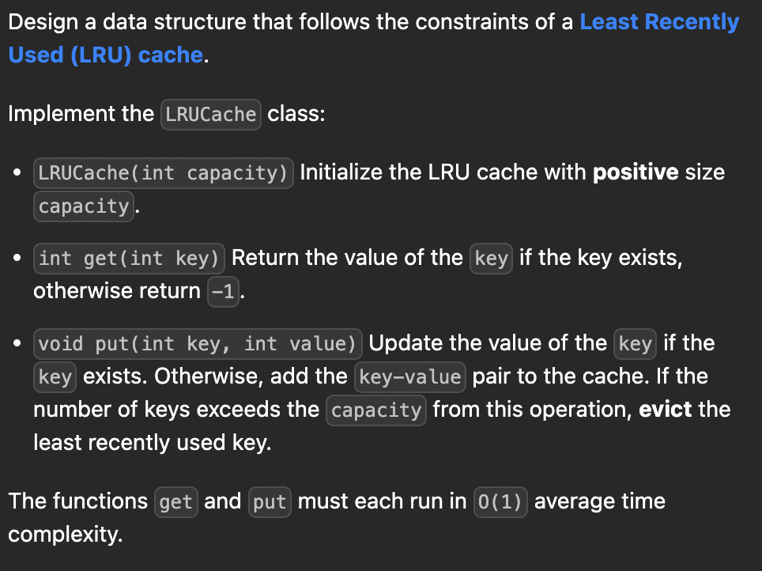  

  ### [Решение](design/lru_cache/main.py)

## 33. Max Stack [(leetcode)](https://leetcode.com/problems/max-stack)
  ### Условие:  
  
  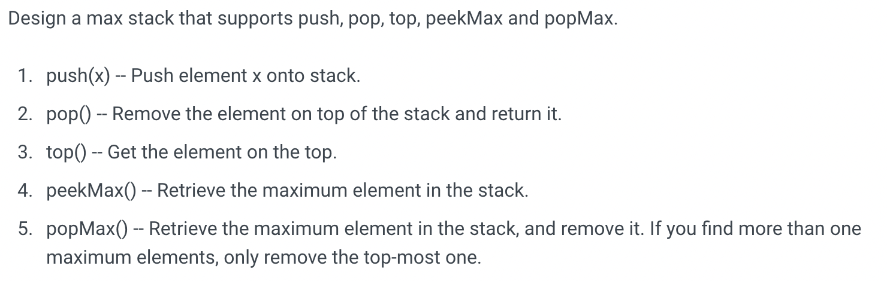  

  ### [Решение](design/max_stack/main.py)

## 34. Number of Recent Calls [(leetcode)](https://leetcode.com/problems/number-of-recent-calls)
  ### Условие:  
  
  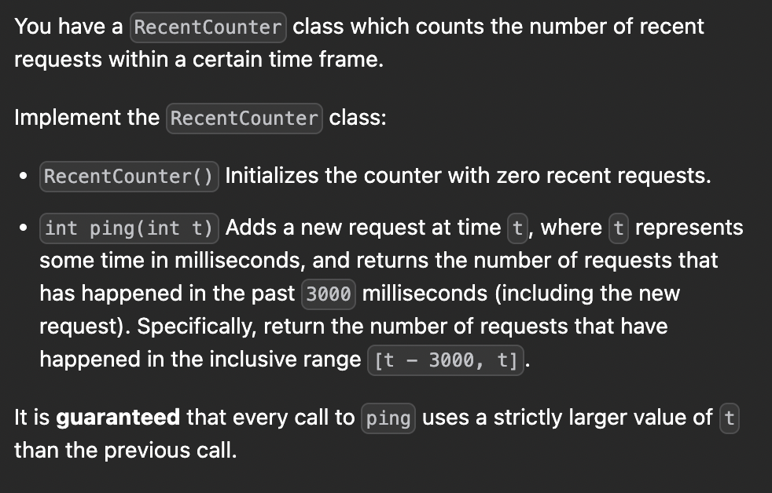  

  ### [Решение](design/number_of_recent_calls/main.py)

## 35. Implement Queue using Stacks [(leetcode)](https://leetcode.com/problems/implement-queue-using-stacks)
  ### Условие:  
  
  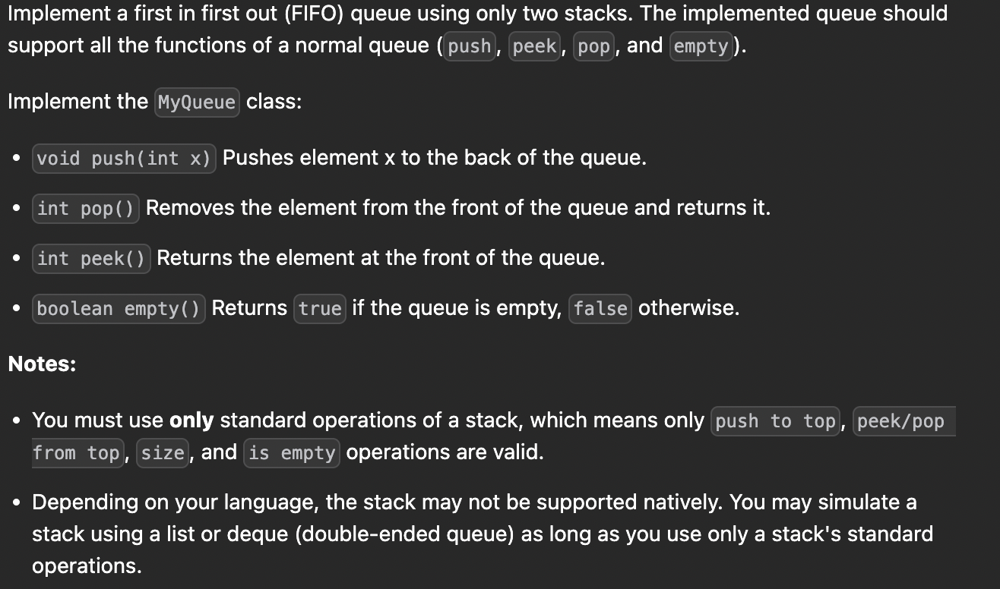  

  ### [Решение](design/queue_using_stacks/main.py)

## 36. Zigzag Iterator [(leetcode)](https://leetcode.com/problems/zigzag-iterator)
  ### Условие:  
  
    

  ### [Решение](design/zigzag_iterator/main.py)

<h1 align="center"><a href="https://github.com/curlyapollo/leetcode/tree/main/linked_lists">
  Linked lists
</a></h1>

## 37. Add Two Numbers [(leetcode)](https://leetcode.com/problems/add-two-numbers)
  ### Условие:  
  
  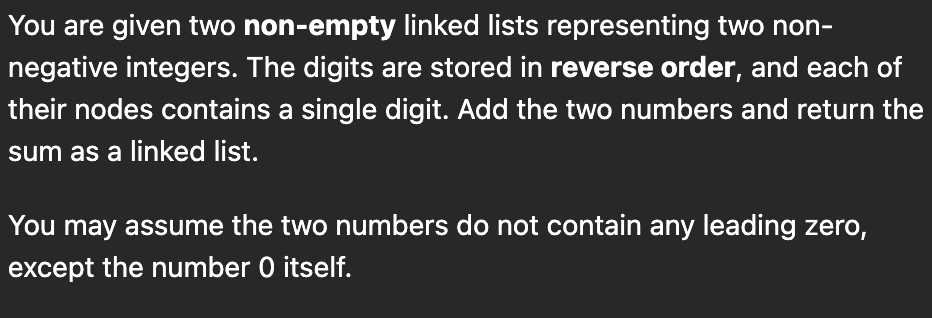  

  ### [Решение](linked_lists/add_two_numbers/main.py)

## 38. Linked List Cycle [(leetcode)](https://leetcode.com/problems/linked-list-cycle)
  ### Условие:  
  
  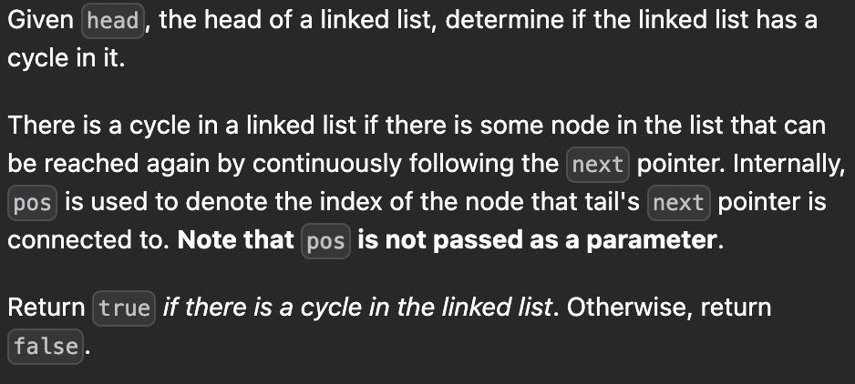  

  ### [Решение](linked_lists/linked_list_cycle/main.py)

## 39. Merge k Sorted Lists [(leetcode)](https://leetcode.com/problems/merge-k-sorted-lists)
  ### Условие:  
  
    

  ### [Решение](linked_lists/merge_k_sorted_lists/main.py)

## 40. Merge Two Sorted Lists [(leetcode)](https://leetcode.com/problems/merge-two-sorted-lists)
  ### Условие:  
  
  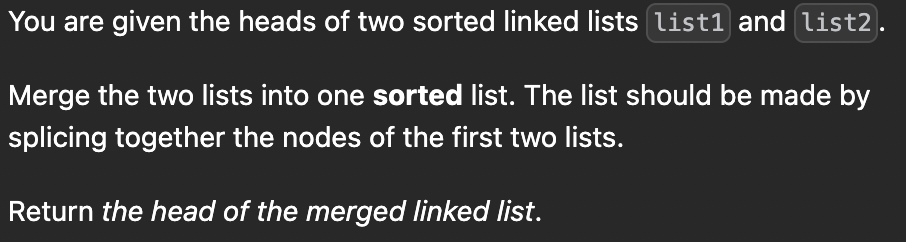  

  ### [Решение](linked_lists/merge_two_sorted_lists/main.py)

## 41. Palindrome Linked List [(leetcode)](https://leetcode.com/problems/palindrome-linked-list)
  ### Условие:  
  
    

  ### [Решение](linked_lists/palindrome_linked_list/main.py)

## 42. Remove Nth Node From End of List [(leetcode)](https://leetcode.com/problems/remove-nth-node-from-end-of-list)
  ### Условие:  
  
    

  ### [Решение](linked_lists/remove_Nth_node_from_end_of_list/main.py)

## 43. Reverse Linked List [(leetcode)](https://leetcode.com/problems/reverse-linked-list)
  ### Условие:  
  
    

  ### [Решение](linked_lists/reverse_linked_list/main.py)

<h1 align="center"><a href="https://github.com/curlyapollo/leetcode/tree/main/prefix_sum">
  Prefix sum
</a></h1>

## 44. Continuous Subarray Sum [(leetcode)](https://leetcode.com/problems/continuous-subarray-sum)
  ### Условие:  
  
  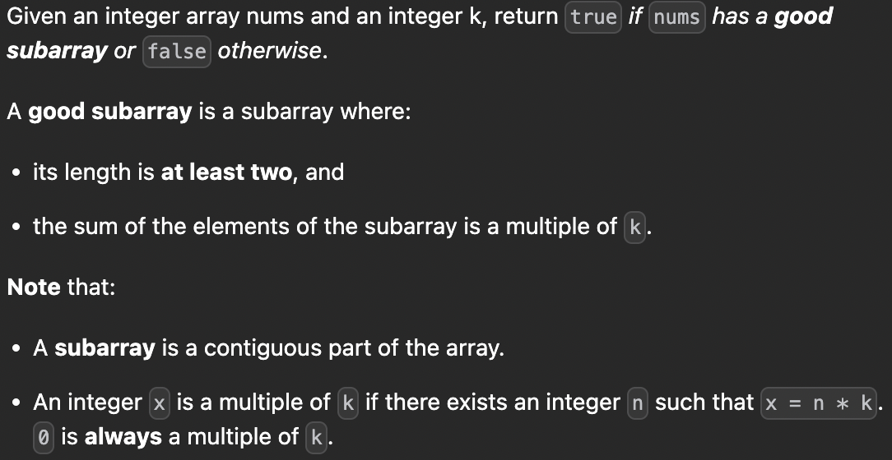  

  ### [Решение](prefix_sum/continious_subarray_sum/main.py)

## 45. Maximum Subarray [(leetcode)](https://leetcode.com/problems/maximum-subarray)
  ### Условие:  
  
    

  ### [Решение](prefix_sum/maximum_subarray/main.py)

## 46. Product of Array Except Self [(leetcode)](https://leetcode.com/problems/product-of-array-except-self)
  ### Условие:  
  
  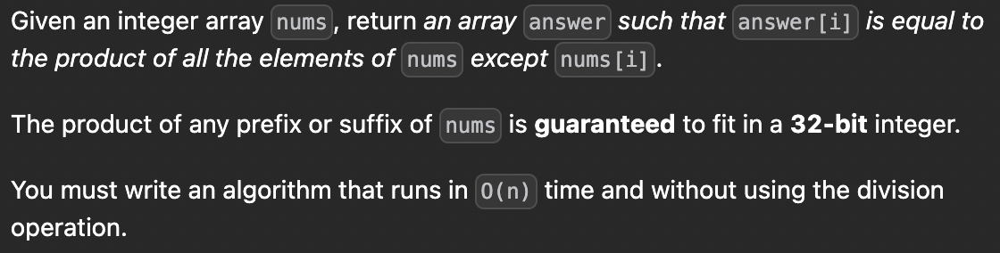  

  ### [Решение](prefix_sum/product_of_array_except_self/main.py)

## 47. Subarray Sum Equals K [(leetcode)](https://leetcode.com/problems/subarray-sum-equals-k)
  ### Условие:  
  
  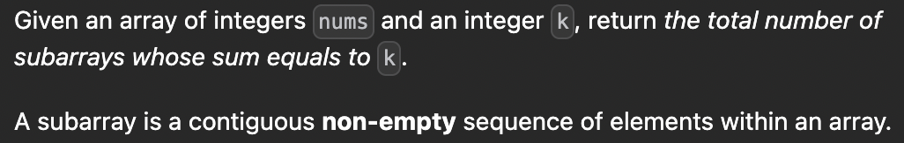  

  ### [Решение](prefix_sum/subarray_sum_equals_k/main.py)

## 48. Subarray Sums Divisible by K [(leetcode)](https://leetcode.com/problems/subarray-sums-divisible-by-k)
  ### Условие:  
  
  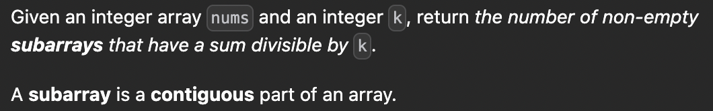  

  ### [Решение](prefix_sum/subarray_sum_equals_k/main.py)

<h1 align="center"><a href="https://github.com/curlyapollo/leetcode/tree/main/stack">
  Stack
</a></h1>

## 49. Evaluate Reverse Polish Notation [(leetcode)](https://leetcode.com/problems/evaluate-reverse-polish-notation)
  ### Условие:  
  
  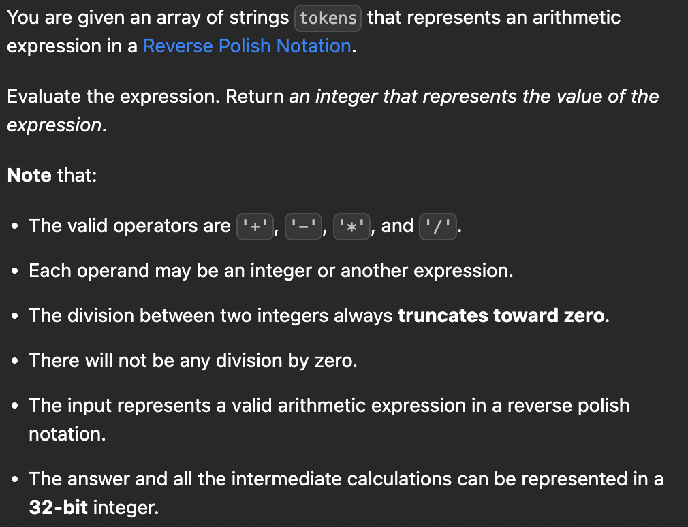  

  ### [Решение](stack/evaluate_reverse_polish_notation/main.py)

## 50. Maximal Rectangle [(leetcode)](https://leetcode.com/problems/maximal-rectangle)
  ### Условие:  
  
    

  ### [Решение](stack/maximal_rectangle/main.py)

## 51. Simplify Path [(leetcode)](https://leetcode.com/problems/simplify-path)
  ### Условие:  
  
  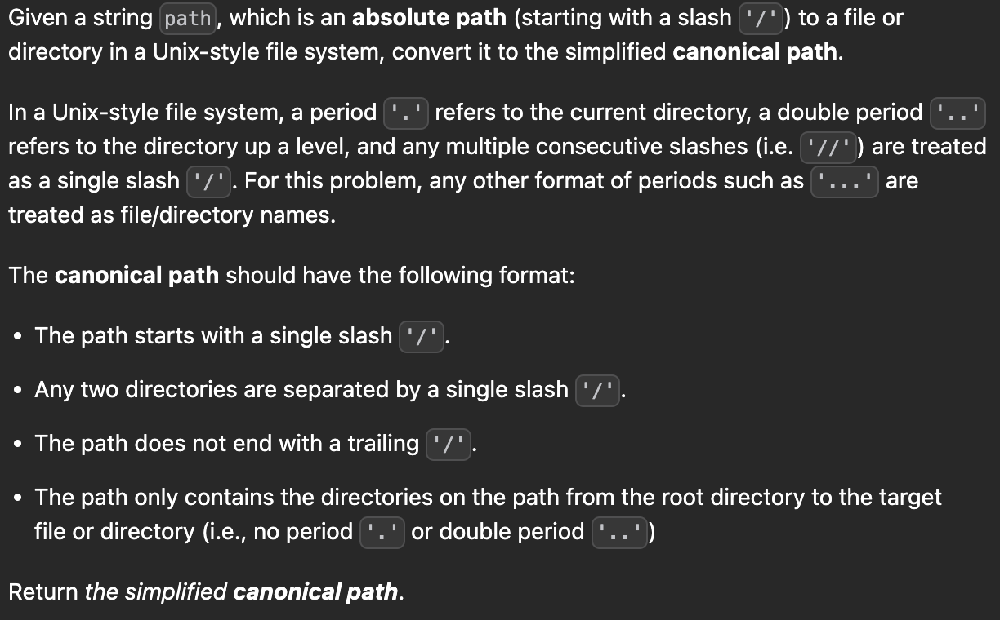  

  ### [Решение](stack/simplify_path/main.py)

## 52. Valid Parentheses [(leetcode)](https://leetcode.com/problems/valid-parentheses)
  ### Условие:  
  
  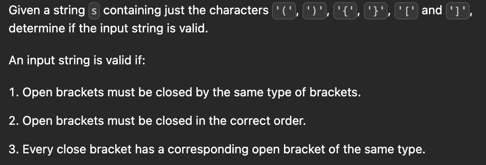  

  ### [Решение](stack/valid_parentheses/main.py)

<h1 align="center"><a href="https://github.com/curlyapollo/leetcode/tree/main/string">
  String
</a></h1>

## 53. Consecutive Characters [(leetcode)](https://leetcode.com/problems/consecutive-characters)
  ### Условие:  
  
  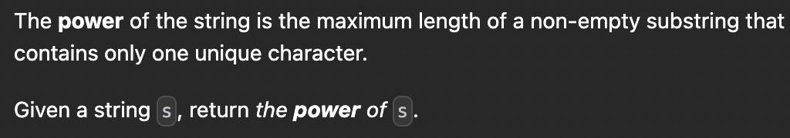  

  ### [Решение](string/consecutive_characters/main.py)

## 54. Find All Anagrams in a String [(leetcode)](https://leetcode.com/problems/find-all-anagrams-in-a-string)
  ### Условие:  
  
  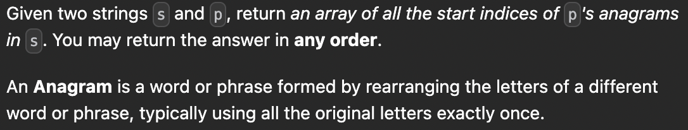  

  ### [Решение](string/find_all_anagrams_in_a_string/main.py)

## 55. Find the Index of the First Occurrence in a String [(leetcode)](https://leetcode.com/problems/find-the-index-of-the-first-occurrence-in-a-string)
  ### Условие:  
  
    

  ### [Решение](string/find_the_index_of_the_first_occurrence_in_a_string/main.py)

## 56. First Unique Character in a String [(leetcode)](https://leetcode.com/problems/first-unique-character-in-a-string)
  ### Условие:  
  
  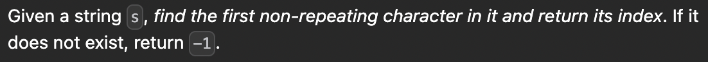  

  ### [Решение](string/first_unique_character_in_string/main.py)

## 57. Is Subsequence [(leetcode)](https://leetcode.com/problems/is-subsequence)
  ### Условие:  
  
  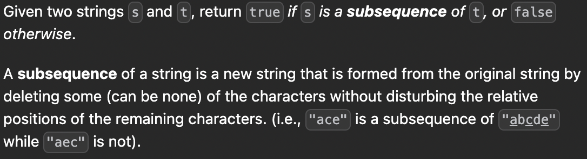  

  ### [Решение](string/is_subsequence/main.py)

## 58. Isomorphic Strings [(leetcode)](https://leetcode.com/problems/isomorphic-strings)
  ### Условие:  
  
  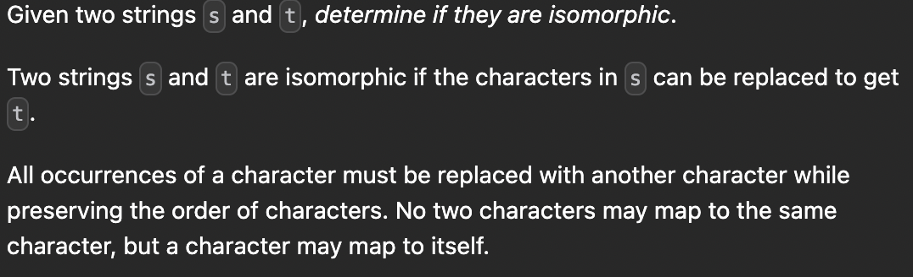  

  ### [Решение](string/isomorphic_strings/main.py)

## 59. Longest Palindromic Substring [(leetcode)](https://leetcode.com/problems/longest-palindromic-substring)
  ### Условие:  
  
    

  ### [Решение](string/longest_palindromic_substring/main.py)

## 60. Longest Repeating Character Replacement [(leetcode)](https://leetcode.com/problems/longest-repeating-character-replacement)
  ### Условие:  
  
  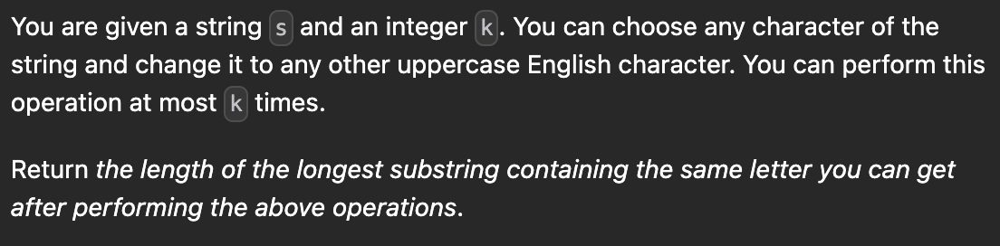  

  ### [Решение](string/longest_repeating_character_replacement/main.py)

## 61. Longest Substring with At Most Two Distinct Characters [(leetcode)](https://leetcode.com/problems/longest-substring-with-at-most-two-distinct-characters)
  ### Условие:  
  
  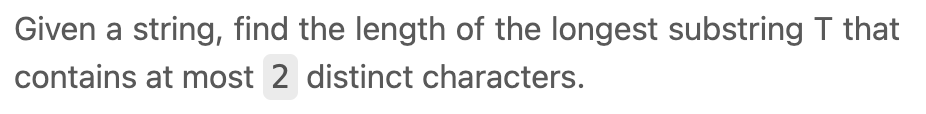  

  ### [Решение](string/longest_substring_with_at_most_two_distinct_characters/main.py)

## 62. Longest Substring Without Repeating Characters [(leetcode)](https://leetcode.com/problems/longest-substring-without-repeating-characters)
  ### Условие:  
  
    

  ### [Решение](string/longest_substring_without_repeating_characters/main.py)

## 63. Multiply Strings [(leetcode)](https://leetcode.com/problems/multiply-strings)
  ### Условие:  
  
  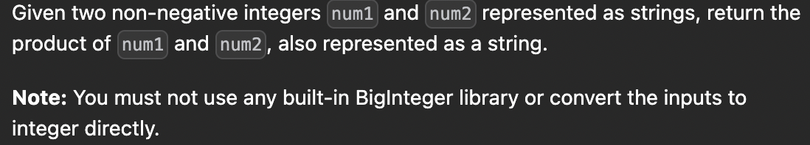  

  ### [Решение](string/multiply_strings/main.py)

## 64. One Edit Distance [(leetcode)](https://leetcode.com/problems/one-edit-distance)
  ### Условие:  
  
  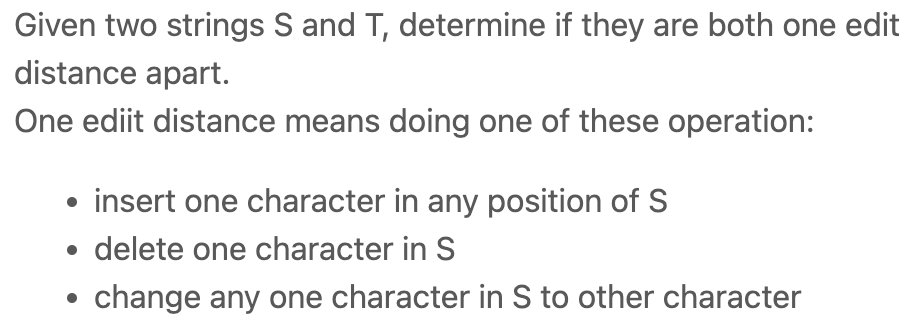  

  ### [Решение](string/one_edit_distance/main.py)

## 65. Partition Labels [(leetcode)](https://leetcode.com/problems/partition-labels)
  ### Условие:  
  
  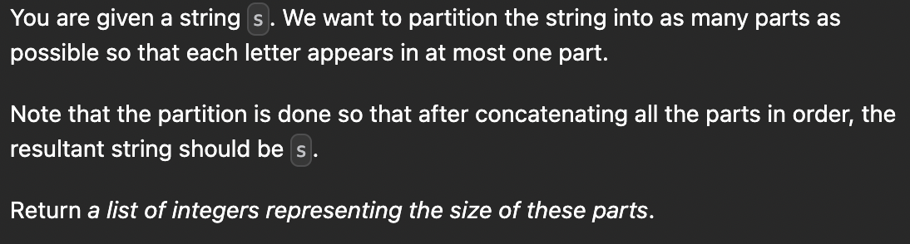  

  ### [Решение](string/partition_labels/main.py)

## 66. Permutation in String [(leetcode)](https://leetcode.com/problems/permutation-in-string)
  ### Условие:  
  
  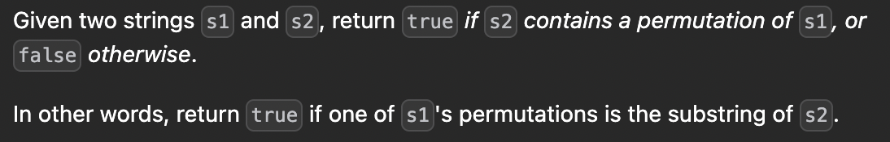  

  ### [Решение](string/permutation_in_string/main.py)

## 67. Reverse Words in a String III [(leetcode)](https://leetcode.com/problems/reverse-words-in-a-string-iii)
  ### Условие:  
  
    

  ### [Решение](string/reverse_words_in_a_string_III/main.py)

## 68. String Compression [(leetcode)](https://leetcode.com/problems/string-compression)
  ### Условие:  
  
  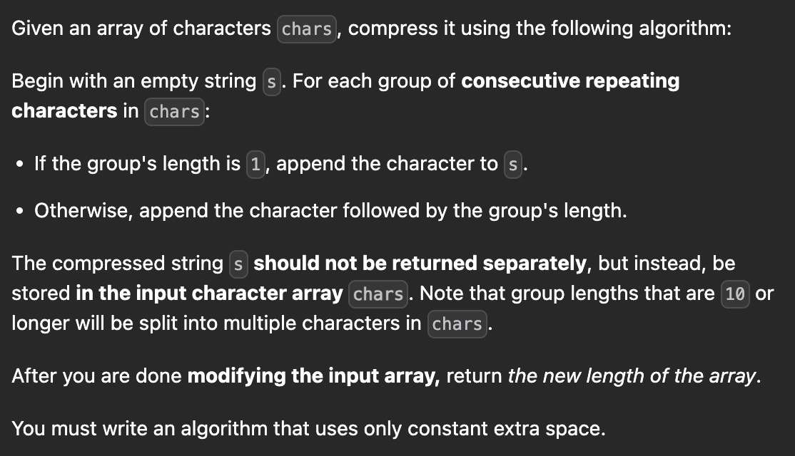  

  ### [Решение](string/string_compression/main.py)

## 69. Valid Anagram [(leetcode)](https://leetcode.com/problems/valid-anagram)
  ### Условие:  
  
  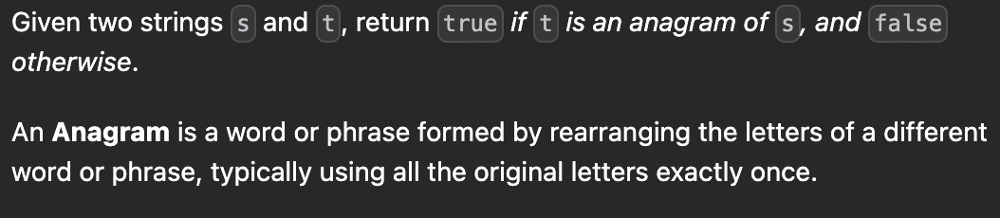  

  ### [Решение](string/valid_anagram/main.py)

## 70. Valid Palindrome [(leetcode)](https://leetcode.com/problems/valid-palindrome)
  ### Условие:  
  
  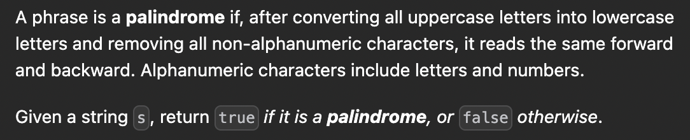  

  ### [Решение](string/valid_palindrome/main.py)

## 71. Valid Palindrome II [(leetcode)](https://leetcode.com/problems/valid-palindrome-ii)
  ### Условие:  
  
    

  ### [Решение](string/valid_palindrome_III/main.py)

<h1 align="center"><a href="https://github.com/curlyapollo/leetcode/tree/main/two_pointers">
  Two pointers
</a></h1>

## 72. Best Time to Buy and Sell Stock [(leetcode)](https://leetcode.com/problems/best-time-to-buy-and-sell-stock)
  ### Условие:  
  
  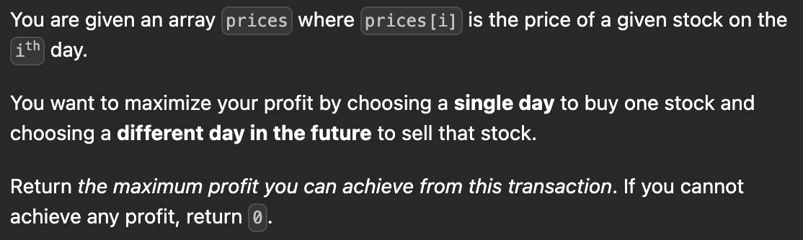  

  ### [Решение](two_pointers/best_time_to_buy_and_sell_stock/main.py)

## 73. Container With Most Water [(leetcode)](https://leetcode.com/problems/container-with-most-water)
  ### Условие:  
  
  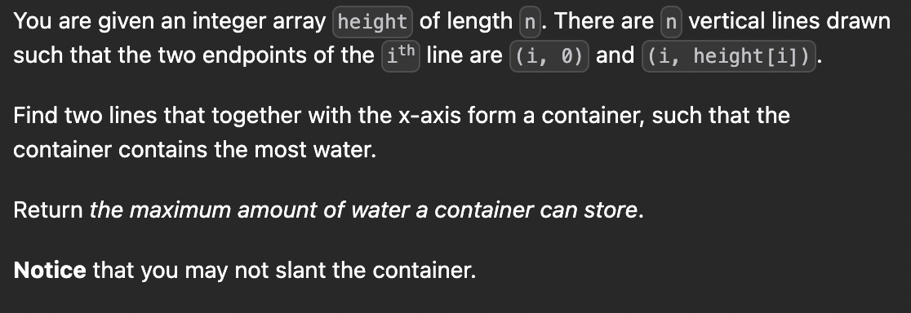  

  ### [Решение](two_pointers/container_with_most_water/main.py)

## 74. Longest Subarray of 1's After Deleting One Element [(leetcode)](https://leetcode.com/problems/longest-subarray-of-1s-after-deleting-one-element)
  ### Условие:  
  
  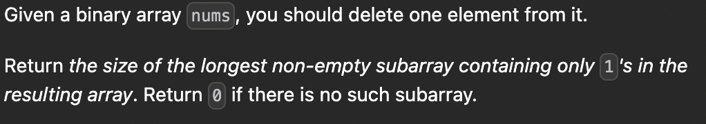  

  ### [Решение](two_pointers/longest_subarray_of_1's_after_deleting_one_element/main.py)

## 75. Max Consecutive Ones II [(leetcode)](https://leetcode.com/problems/max-consecutive-ones-ii)
  ### Условие:  
  
    

  ### [Решение](two_pointers/max_consecutive_ones_II/main.py)

## 76. Max Consecutive Ones III [(leetcode)](https://leetcode.com/problems/max-consecutive-ones-iii)
  ### Условие:  
  
    

  ### [Решение](two_pointers/max_consecutive_ones_III/main.py)

## 77. Product of Two Run-Length Encoded Arrays [(leetcode)](https://leetcode.com/problems/product-of-two-run-length-encoded-arrays)
  ### Условие:  
  
  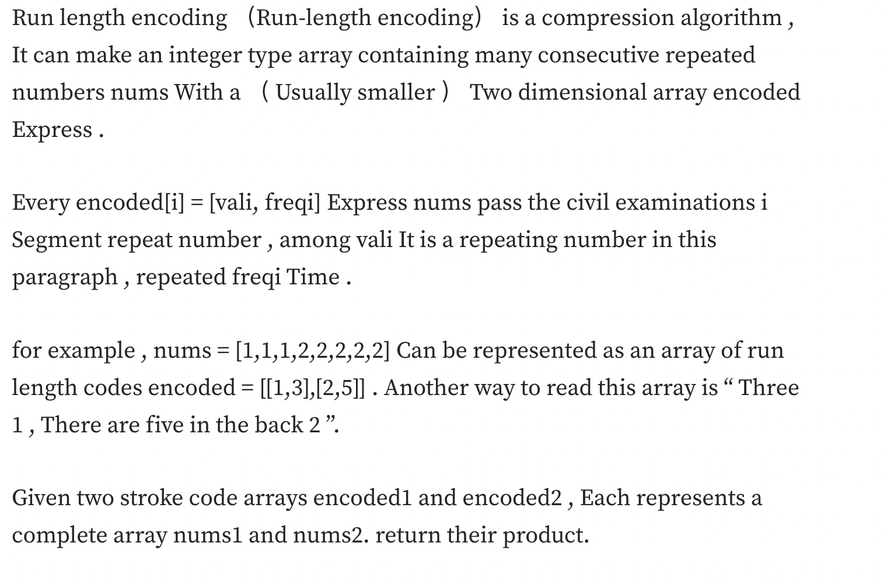  

  ### [Решение](two_pointers/product_of_two_run_length_encoded_arrays/main.py)

## 78. Remove Duplicates from Sorted Array [(leetcode)](https://leetcode.com/problems/remove-duplicates-from-sorted-array)
  ### Условие:  
  
  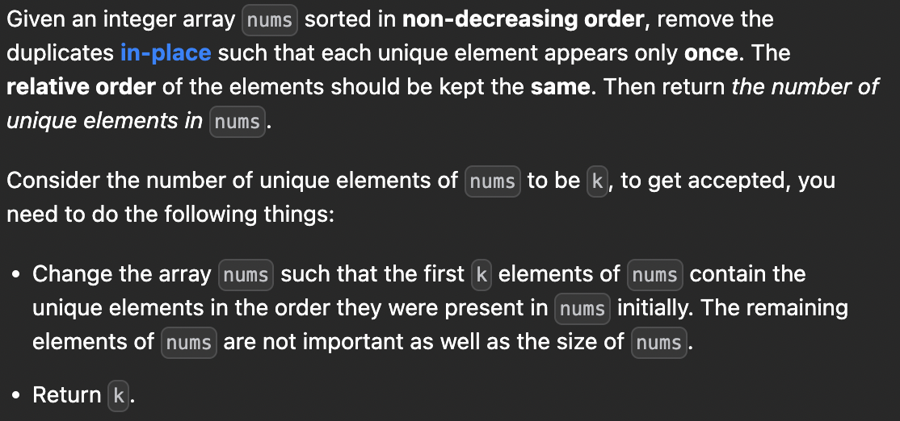  

  ### [Решение](two_pointers/remove_duplicates_from_sorted_array/main.py)

## 79. Shortest Unsorted Continuous Subarray [(leetcode)](https://leetcode.com/problems/shortest-unsorted-continuous-subarray)
  ### Условие:  
  
  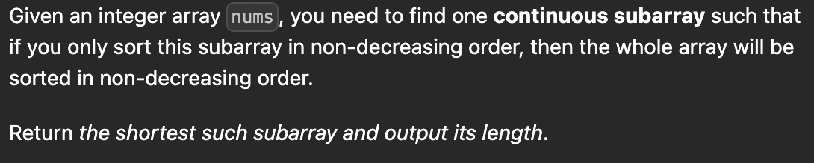  

  ### [Решение](two_pointers/shortest_unsorted_continuous_subarray/main.py)

## 80. Squares of a Sorted Array [(leetcode)](https://leetcode.com/problems/squares-of-a-sorted-array)
  ### Условие:  
  
    

  ### [Решение](two_pointers/squares_of_a_sorted_array/main.py)

## 81. Summary Ranges [(leetcode)](https://leetcode.com/problems/summary-ranges)
  ### Условие:  
  
  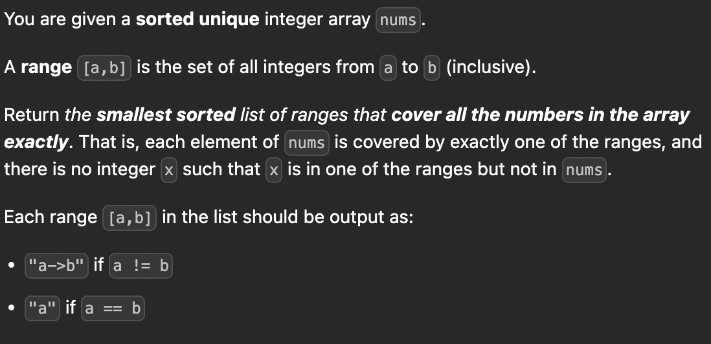  

  ### [Решение](two_pointers/summary_ranges/main.py)

## 82. Trapping Rain Water [(leetcode)](https://leetcode.com/problems/trapping-rain-water)
  ### Условие:  
  
    

  ### [Решение](two_pointers/trapping_rain_water/main.py)

## 83. Two Sum II - Input Array Is Sorted [(leetcode)](https://leetcode.com/problems/two-sum-ii-input-array-is-sorted)
  ### Условие:  
  
  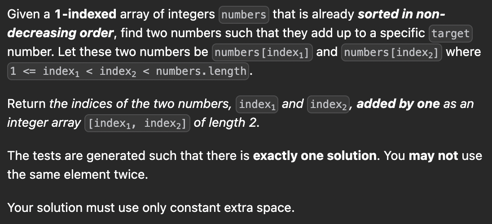  

  ### [Решение](two_pointers/two_sum_||_input_array_is_sorted/main.py)

<h1 align="center"><a href="https://github.com/curlyapollo/leetcode/tree/main/other">
  Other
</a></h1>

## 84. Find the Difference of Two Arrays [(leetcode)](https://leetcode.com/problems/find-the-difference-of-two-arrays)
  ### Условие:  
  
  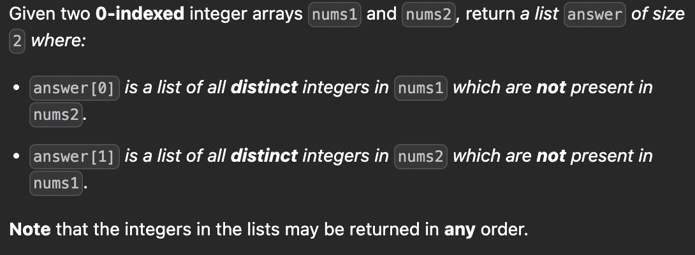  

  ### [Решение](other/find_the_difference_of_two_arrays/main.py)

## 85. Find the Prefix Common Array of Two Arrays [(leetcode)](https://leetcode.com/problems/find-the-prefix-common-array-of-two-arrays)
  ### Условие:  
  
  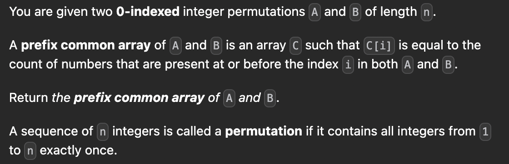  

  ### [Решение](other/find_the_prefix_common_array_of_two_arrays/main.py)

## 86. Generate Parentheses [(leetcode)](https://leetcode.com/problems/generate-parentheses)
  ### Условие:  
  
    

  ### [Решение](other/generate_parentheses/main.py)

## 87. Group Anagrams [(leetcode)](https://leetcode.com/problems/group-anagrams)
  ### Условие:  
  
  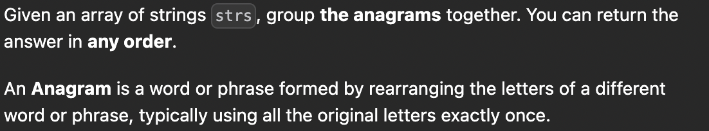  

  ### [Решение](other/group_anagrams/main.py)

## 88. Integer to Roman [(leetcode)](https://leetcode.com/problems/integer-to-roman)
  ### Условие:  
  
  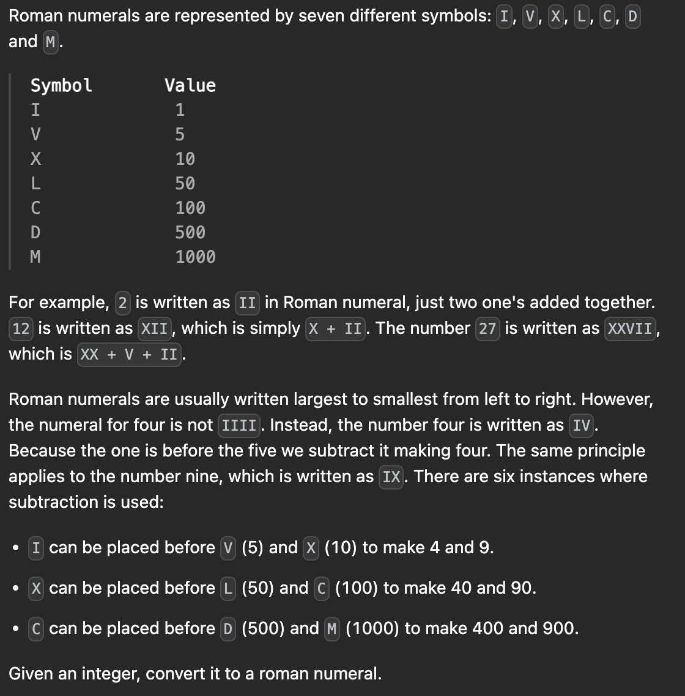  

  ### [Решение](other/integer_to_roman/main.py)

## 89. Intersection of Two Arrays II [(leetcode)](https://leetcode.com/problems/intersection-of-two-arrays-ii)
  ### Условие:  
  
  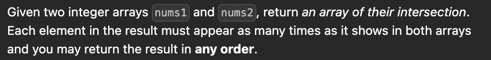  

  ### [Решение](other/intersection_of_two_arrays_II/main.py)

## 90. Interval List Intersections [(leetcode)](https://leetcode.com/problems/interval-list-intersections)
  ### Условие:  
  
  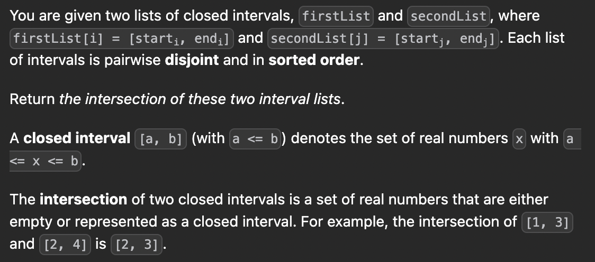  

  ### [Решение](other/interval_list_intersections/main.py)

## 91. Jewels and Stones [(leetcode)](https://leetcode.com/problems/jewels-and-stones)
  ### Условие:  
  
  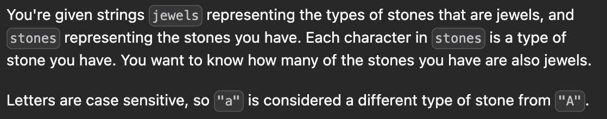  

  ### [Решение](other/jewels_and_stones/main.py)

## 92. Line Reflection [(leetcode)](https://leetcode.com/problems/line-reflection)
  ### Условие:  
  
  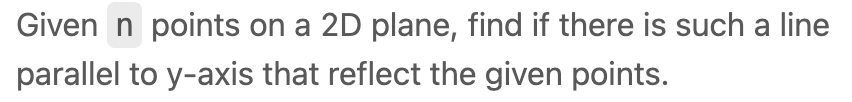  

  ### [Решение](other/line_reflection/main.py)

## 93. Matrix Diagonal Sum [(leetcode)](https://leetcode.com/problems/matrix-diagonal-sum)
  ### Условие:  
  
  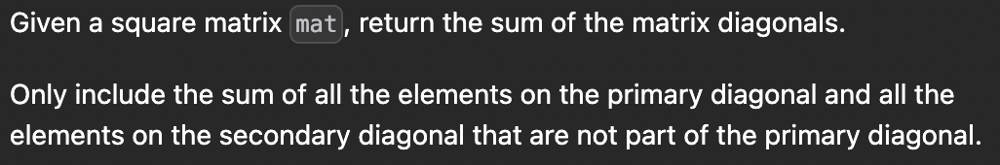  

  ### [Решение](other/matrix_diagonal_sum/main.py)

## 94. Maximize Distance to Closest Person [(leetcode)](https://leetcode.com/problems/maximize-distance-to-closest-person)
  ### Условие:  
  
  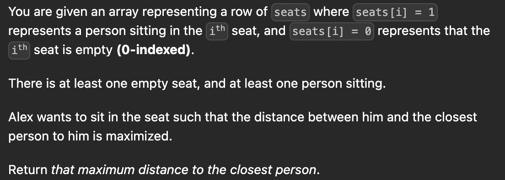  

  ### [Решение](other/maximize_distance_to_closest_person/main.py)

## 95. Meeting Rooms [(leetcode)](https://leetcode.com/problems/meeting-rooms)
  ### Условие:  
  
  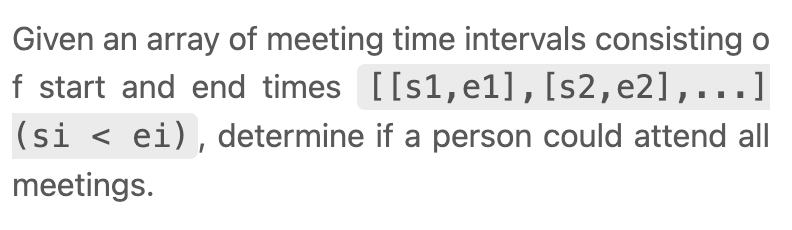  

  ### [Решение](other/meeting_rooms/main.py)

## 96. Meeting Rooms II [(leetcode)](https://leetcode.com/problems/meeting-rooms-ii)
  ### Условие:  
  
  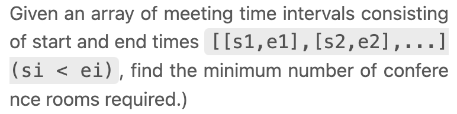  

  ### [Решение](other/meeting_rooms_II/main.py)

## 97. Merge Intervals [(leetcode)](https://leetcode.com/problems/merge-intervals)
  ### Условие:  
  
    

  ### [Решение](other/merge_intervals/main.py)

## 98. Merge Sorted Array [(leetcode)](https://leetcode.com/problems/merge-sorted-array)
  ### Условие:  
  
  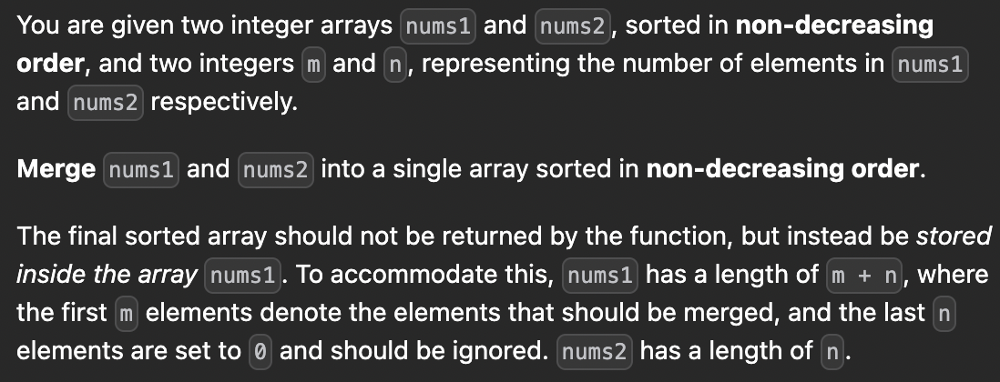  

  ### [Решение](other/merge_sorted_array/main.py)

## 99. Missing Number [(leetcode)](https://leetcode.com/problems/missing-number)
  ### Условие:  
  
    

  ### [Решение](other/missing_number/main.py)

## 100. Move Zeroes [(leetcode)](https://leetcode.com/problems/move-zeroes)
  ### Условие:  
  
  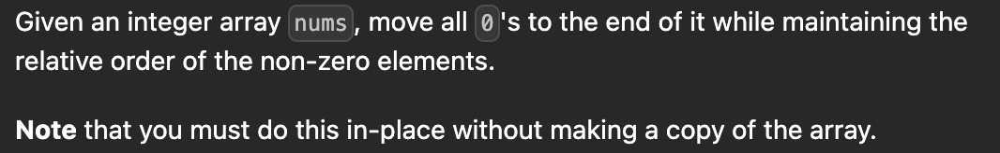  

  ### [Решение](other/move_zeroes/main.py)

## 101. Number of Students Doing Homework at a Given Time [(leetcode)](https://leetcode.com/problems/number-of-students-doing-homework-at-a-given-time)
  ### Условие:  
  
  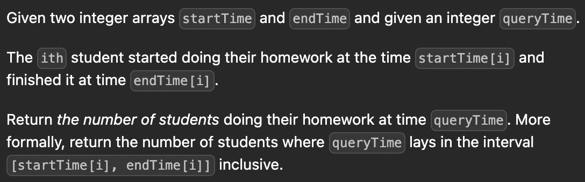  

  ### [Решение](other/number_of_students_doing_homework_at_a_given_time/main.py)

## 102. Perfect Squares [(leetcode)](https://leetcode.com/problems/perfect-squares)
  ### Условие:  
  
  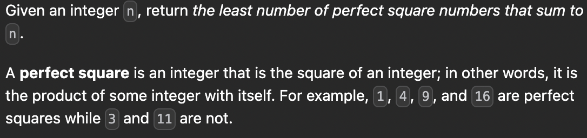  

  ### [Решение](other/perfect_squares/main.py)

## 103. Roman to Integer [(leetcode)](https://leetcode.com/problems/roman-to-integer)
  ### Условие:  
  
  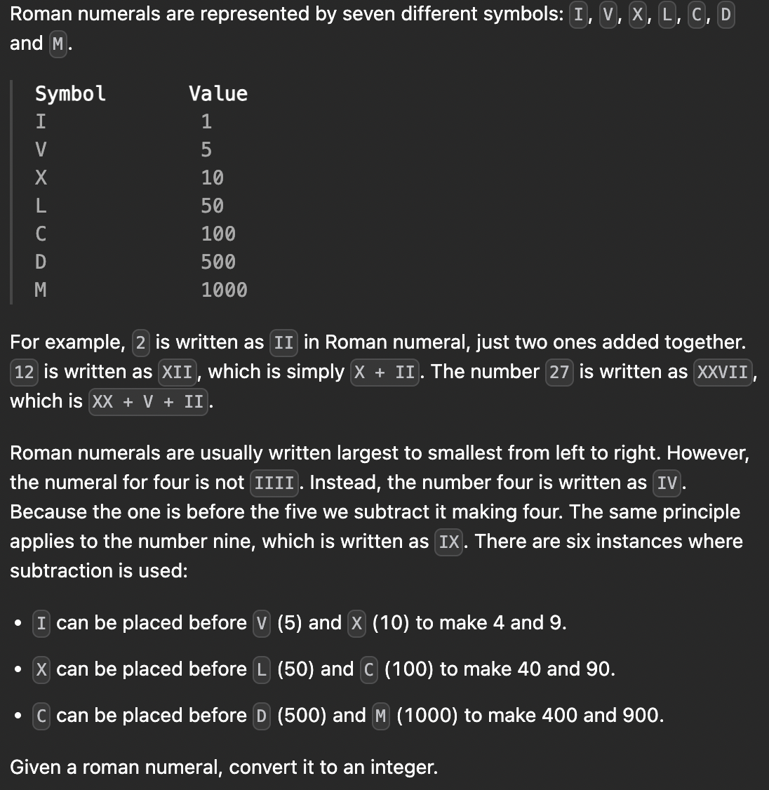  

  ### [Решение](other/roman_to_integer/main.py)

## 104. Rotate Image [(leetcode)](https://leetcode.com/problems/rotate-image)
  ### Условие:  
  
  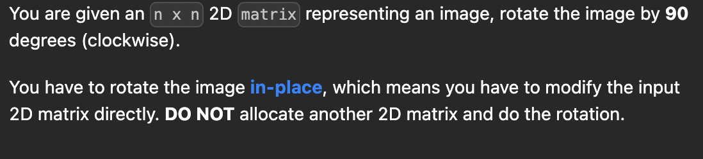  

  ### [Решение](other/rotate_image/main.py)

## 105. Single Number [(leetcode)](https://leetcode.com/problems/single-number)
  ### Условие:  
  
  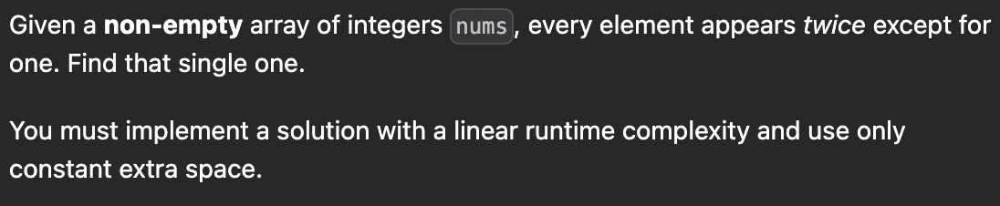  

  ### [Решение](other/single_number/main.py)

## 106. Spiral Matrix II [(leetcode)](https://leetcode.com/problems/spiral-matrix-ii)
  ### Условие:  
  
  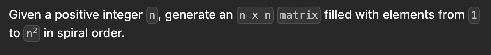  

  ### [Решение](other/spiral_matrix/main.py)

## 107. Top K Frequent Elements [(leetcode)](https://leetcode.com/problems/top-k-frequent-elements)
  ### Условие:  
  
  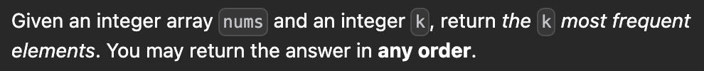  

  ### [Решение](other/top_k_frequent_elements/main.py)

## 108. Top K Frequent Words [(leetcode)](https://leetcode.com/problems/top-k-frequent-words)
  ### Условие:  
  
  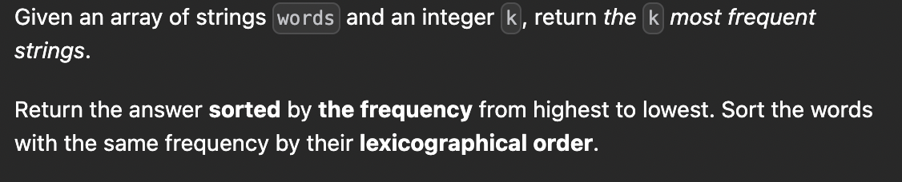  

  ### [Решение](other/top_k_frequent_words/main.py)

## 109. Two Sum [(leetcode)](https://leetcode.com/problems/two-sum)
  ### Условие:  
  
  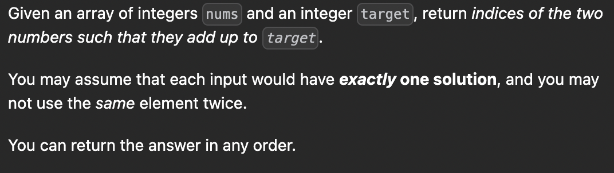  

  ### [Решение](other/two_sum/main.py)

   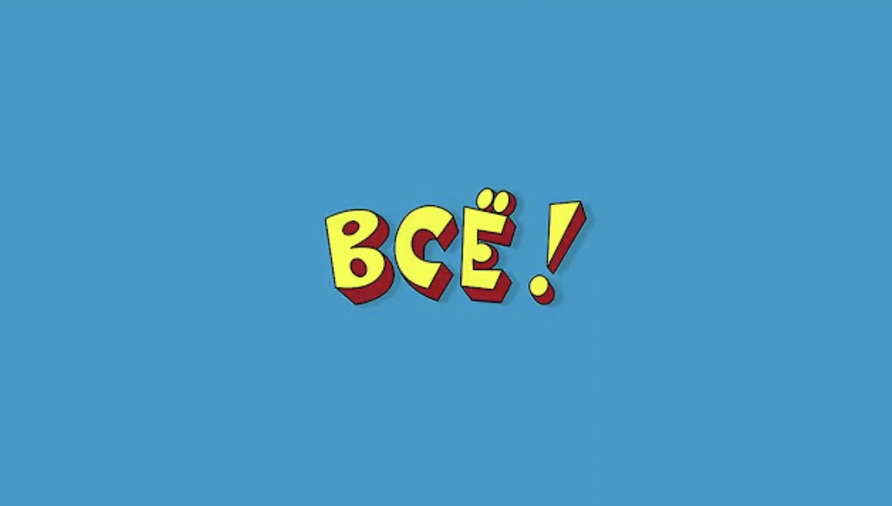  

  
    
  
